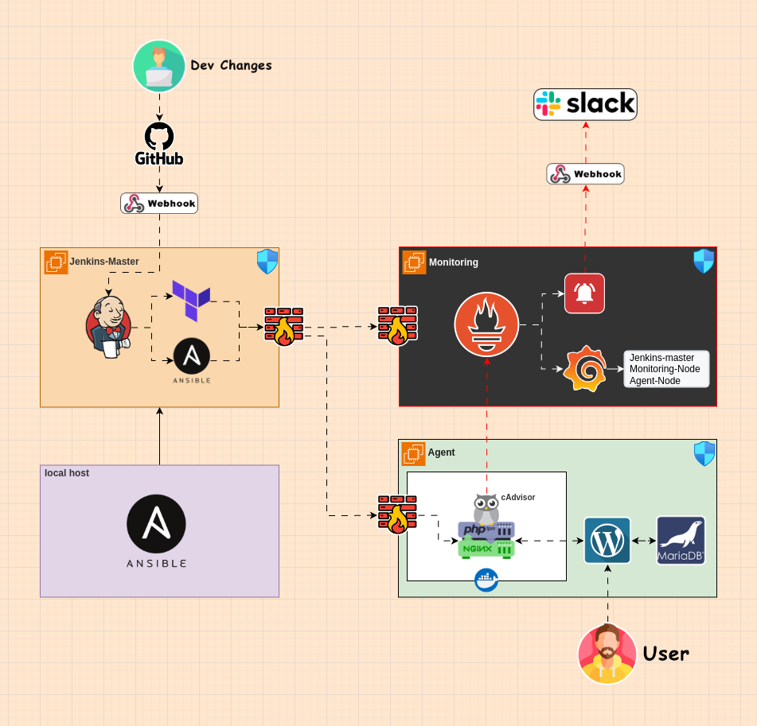

# CI/CD Pipeline with Terraform, Ansible, Docker, and Prometheus

## Overview
This project implements a comprehensive CI/CD pipeline that automates the deployment of a WordPress application with monitoring capabilities. The pipeline utilizes various DevOps tools including Jenkins, Terraform, Ansible, Docker, and Prometheus.



## Features
- **Infrastructure as Code** using Terraform
- **Configuration Management** with Ansible
- **Containerization** using Docker
- **Monitoring** with Prometheus and Grafana
- **Automated Deployments** via Jenkins Pipeline
- **Security** implemented through AWS Security Groups and iptables

## CI/CD Workflow
1. **Code Push**: Developer pushes code to GitHub repository
2. **Jenkins Trigger**: GitHub webhook triggers Jenkins pipeline
3. **Infrastructure Provisioning**: 
   - Terraform creates EC2 instances for:
     - WordPress application (agent)
     - Monitoring server (Prometheus & Grafana)
4. **Configuration Management**:
   - Ansible configures:
     - WordPress application server
     - Docker containers (nginx, php-fpm, cAdvisor)
     - Prometheus, Grafana, and Alert Manager
5. **Monitoring Setup**:
   - Prometheus monitors all instances
   - Alert Manager configured with Slack notifications
   - Grafana dashboards for visualization

## Prerequisites
- AWS Account with appropriate permissions
- GitHub repository
- Local machine with:
  - Git
  - Ansible

## Installation & Setup

### 1. Clone the Repository
```bash
git clone https://github.com/moeid404/CI-CD-terraform-ansible-docker-prometheus.git
cd CI-CD-terraform-ansible-docker-prometheus
```

### 2. Jenkins Master Setup
```bash
cd ansible
# Update ssh_key.pem with yours.
# Update Jenkins Master IP in hosts.ini and vars.yml
ansible-playbook -i hosts.ini jenkins_play.yml
```

### 3. Jenkins Configuration
1. Access Jenkins UI: `http://<jenkins-master-ip>:8080`
2. Configure credentials:
   - SSH Key: As SSH user and private key credentials.
   - AWS Access Key ID: As Secret Text
   - AWS Secret Access Key: As Secret Text
3. Create pipeline job:
   - Configure GitHub webhook
   - Use Pipeline script from SCM

## Components

### Jenkins Master
- Serves as the CI/CD orchestrator
- Runs Terraform for infrastructure provisioning
- Executes Ansible playbooks for configuration

### Application Server (Agent)
- Hosts WordPress application with MariaDB.
- Runs Docker containers:
  - Nginx
  - PHP-FPM
  - cAdvisor
- Configured with iptables firewall

### Monitoring Server
- Prometheus for metrics collection
- Grafana for visualization
- Alert Manager for notifications
- Configured with iptables firewall

## Security
- AWS Security Groups
- iptables firewall rules
- SSH hardening:
  - Custom port
  - Key-based authentication
  - Root login disabled

## Monitoring & Alerts
- Node Exporter on all instances
- Custom alert rules for:
  - Nginx container
  - PHP-FPM container
- Slack notifications for alerts if the containers down as an example.

## Usage
1. Ensure all prerequisites are met
2. Follow the Installation & Setup steps
3. Push code to your repository
4. Jenkins will automatically:
   - Provision infrastructure
   - Deploy application
   - Configure monitoring

## Author
- **Mohamed Eid** - [GitHub Profile](https://github.com/moeid404)  
  Email: moeid404@gmail.com

Feel free to reach out to me for any questions, issues, or contributions.